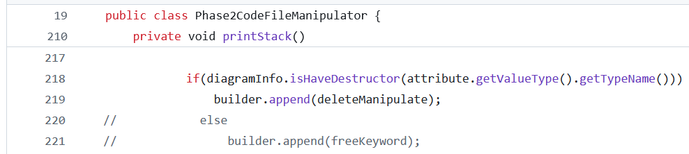

## استفاده از الگوی Facade 
### مورد اول - کلاس [Parser](src/main/java/MiniJava/parser/Parser.java) 
در ابتدا مشاهده می‌کنیم که در کلاس 
[Parser](src/main/java/MiniJava/parser/Parser.java)
از سرویس‌های متعددی مانند lexicalAnalyzer و ParseTable استفاده شده است. این استفاده متعدد از سرویس‌های مختلف باعث شده که خوانایی کد در این کلاس پایین بیاید و دنبال کردن عملکرد اصلی آن سخت باشد. 

برای حل این مشکل ما یک کلاس 
Facade 
به نام
[TransitionHandlerFacade](src/main/java/MiniJava/parser/TransitionHandlerFacade.java)
به پروژه اضافه می‌کنیم تا سرویس‌های مختلف را به داخل آن انتقال دهیم و فقط دو تابع 
`printMemory`
و 
`handleNextToken`
را به بیرون باز می‌کنیم تا کلاس
[Parser](src/main/java/MiniJava/parser/Parser.java)
از آن‌ها استفاده کند و عملکردی که از آن انتظار می‌رود را انجام دهد.

مشاهده می‌کنید که خوانایی این کلاس و فهم عملکرد آن بسیار راحت‌تر از حالت قبل شده است.


### مورد دوم - کلاس [Token](src/main/java/MiniJava/scanner/token/Token.java)
در کلاس 
[Token](src/main/java/MiniJava/scanner/token/Token.java)
و در تابع 
`getTyepFormString`
مشاهده می‌کنیم که برای چک کردن اینکه آیا رشته ورودی با پترن‌ها تطابق دارند یا خیر، از سرویس‌های 
Pattern
و 
Matcher
جاوا استفاده می‌شود. 

برای اینکه نیاز این کلاس را به استفاده از این دو سرویس از بین ببریم، یک کلاس 
Facade 
به نام
[PatternMatcherFacade](src/main/java/MiniJava/scanner/token/PatternMatcherFacade.java)
تعریف می‌کنیم و استفاده از این دو سرویس برای چک کردن مچ شدن با یک الگو را درون آن انجام می‌دهیم.

با استفاده از این کار باعث می‌شویم خوانایی تابع
`getTyepFormString`
بالاتر برود و فقط عملکردی که از آن انتظار می‌رود را انجام دهد و دیگر لازم نباشد تا آبجکت‌هایی از جنس 
Pattern 
و 
Matcher 
در خود بسازد.


## Separate Query from Modifier
برای این بخش ما کلاس
[Memory](src/main/java/MiniJava/codeGenerator/Memory.java)
را انتخاب کردیم. در این کلاس دوتابع
`getTemp`
و
`getDateAddress`
هم فیلد را تغییر می‌دهند و هم آن را خروجی می‌دهند و به همین علت نیاز داریم تا این دو عملکرد را جدا کنیم.

برای حل این مشکل، دوتابع 
`increaseTemp`
و
`increaseDateAddress`
را اضافه می‌کنیم و در همه جاهایی که تابع‌های 
get
صدا زده می‌شدند، قبلشان این توابع 
increase
را صدا می‌کنیم تا عملکرد برنامه مختل نشود و در عین حال بتوانیم 
query
را از 
modifier 
جدا کنیم. 


### استفاده از Polymorphism به‌جای شرط

در این بازآرایی، دنبال شرط‌هایی هستیم که در صورت رخ‌دادن هر کدام، یک تابع مجزا اجرا می‌شود. در این حالت، به‌ازای هر حالت ممکن شرط، یک کلاس فرزند با ارث‌بری از کلاس آن تابع می‌سازیم و با اورراید کردن تابع مذکور، فانکشنالیتی مورد نظر را پیاده می‌کنیم. یکی از این موارد، در کلاس
`Action.java`
پیدا می‌شود که این‌گونه بازآرایی می‌کنیم:

```Java

public abstract class Action {
    public act action;
    //if action = shift : number is state
    //if action = reduce : number is number of rule
    public int number;

    public Action(act action, int number) {
        this.action = action;
        this.number = number;
    }

    public abstract String toString();
}

class AcceptAction extends Action {
    public AcceptAction(act action, int number) {
        super(action, number);
    }

    public String toString() {
        return "acc";
    }
}

class ShiftAction extends Action {

    public ShiftAction(act action, int number) {
        super(action, number);
    }

    public String toString() {
        return "s" + number;
    }
}

class ReduceAction extends Action {

    public ReduceAction(act action, int number) {
        super(action, number);
    }

    public String toString() {
        return "r" + number;
    }
}

class DefaultAction extends Action {

    public DefaultAction(act action, int number) {
        super(action, number);
    }

    public String toString() {
        return action.toString() + number;
    }
}

```

اکنون در تمام جاهایی که از این کلاس شی‌ای ساخته شده بود، کلاس فرزند متناظر را جایگزین می‌کنیم. مانند این تکه کد در فایل 
`ParseTable.java`:

```Java

for (int j = 1; j < cols.length; j++) {
                if (!cols[j].equals("")) {
                    if (cols[j].equals("acc")) {
                        actionTable.get(actionTable.size() - 1).put(terminals.get(j), new Action(act.accept, 0));
                    } else if (terminals.containsKey(j)) {
//                        try {
                        Token t = terminals.get(j);
                        Action a = new Action(cols[j].charAt(0) == 'r' ? act.reduce : act.shift, Integer.parseInt(cols[j].substring(1)));
                        actionTable.get(actionTable.size() - 1).put(t, a);
//                        }catch (StringIndexOutOfBoundsException e){
//                            e.printStackTrace();
//                        }
                    } else if (nonTerminals.containsKey(j)) {
                        gotoTable.get(gotoTable.size() - 1).put(nonTerminals.get(j), Integer.parseInt(cols[j]));
                    } else {
                        throw new Exception();
                    }
                }
            }

```

که بعد از بازآرایی این‌گونه می‌شود:

```Java

for (int j = 1; j < cols.length; j++) {
                if (!cols[j].equals("")) {
                    if (cols[j].equals("acc")) {
                        actionTable.get(actionTable.size() - 1).put(terminals.get(j), new AcceptAction(act.accept, 0));
                    } else if (terminals.containsKey(j)) {
                        Token t = terminals.get(j);
                        Action a;
                        if (cols[j].charAt(0) == 'r')
                            a = new AcceptAction(act.reduce, Integer.parseInt(cols[j].substring(1)));
                        else
                            a = new ShiftAction(act.shift, Integer.parseInt(cols[j].substring(1)));
                        actionTable.get(actionTable.size() - 1).put(t, a);
                    } else if (nonTerminals.containsKey(j)) {
                        gotoTable.get(gotoTable.size() - 1).put(nonTerminals.get(j), Integer.parseInt(cols[j]));
                    } else {
                        throw new Exception();
                    }
                }
            }

```

### Remove Assignments to Parameters

پارامترهای یک تابع درون بدنه‌ی آن نباید تغییر کنند. بهتر است از یک متغیر کمکی به‌جای آن استفاده کنیم.
در کلاس
`Rule.java`
این تکه‌کد مشاهده می‌شود:

```Java
public class Rule {
    public Rule(String stringRule) {
        int index = stringRule.indexOf("#");
        if (index != -1) {
            try {
                semanticAction = Integer.parseInt(stringRule.substring(index + 1));
            } catch (NumberFormatException ex) {
                semanticAction = 0;
            }
            stringRule = stringRule.substring(0, index);
        } else {
            semanticAction = 0;
        }
        String[] splited = stringRule.split("->");
        ...
    }
}
```

که به‌وضوح پارامتر
`stringRule`
تغییر کرده‌است. بعد از بازآرایی، این تکه‌کد این‌چنین می‌شود:

```Java
public class Rule {
    public Rule(String stringRule) {
        int index = stringRule.indexOf("#");
        String tmpStringRule = stringRule;
        if (index != -1) {
            try {
                semanticAction = Integer.parseInt(tmpStringRule.substring(index + 1));
            } catch (NumberFormatException ex) {
                semanticAction = 0;
            }
            tmpStringRule = tmpStringRule.substring(0, index);
        } else {
            semanticAction = 0;
        }
        String[] splited = tmpStringRule.split("->");
        ...
    }
}
```

### Replace Constructor with Factory Method

یک تابع که شی‌های کلاس را می‌سازد، به کلاس اضافه می‌کنیم:

```Java

public static Action createAction(act action, int number) {
        switch (action) {
            case shift:
                return new ShiftAction(action, number);
            case accept:
                return new ReduceAction(action, number);
            case reduce:
                return new AcceptAction(action, number);
            default:
                return new DefaultAction(action, number);
        }
    }

```

اکنون هرجای کد که از این کلاس شیی ساخته‌ایم، از این تابع استفاده می‌کنیم. برای مثال، تکه‌کد زیر بازآرایی شده‌ی حالت قبلی است:

```Java

for (int j = 1; j < cols.length; j++) {
                if (!cols[j].equals("")) {
                    if (cols[j].equals("acc")) {
                        actionTable.get(actionTable.size() - 1).put(terminals.get(j), Action.createAction(act.accept, 0));
                    } else if (terminals.containsKey(j)) {
                        Token t = terminals.get(j);
                        Action a = Action.createAction(cols[j].charAt(0) == 'r' ? act.reduce : act.shift, Integer.parseInt(cols[j].substring(1)));
                        actionTable.get(actionTable.size() - 1).put(t, a);
                    } else if (nonTerminals.containsKey(j)) {
                        gotoTable.get(gotoTable.size() - 1).put(nonTerminals.get(j), Integer.parseInt(cols[j]));
                    } else {
                        throw new Exception();
                    }
                }
            }

```

---


# Questions

1. 
-  کد تمیز: کد تمیز به کدی گفته می‌شود که خوانا، قابل فهم، ساده، و بهینه باشد. این نوع کد معمولاً ساختاری واضح دارد، از استانداردهای برنامه‌نویسی پیروی می‌کند و به راحتی قابل نگهداری و توسعه است.

-  بدهی فنی: بدهی فنی به تصمیم‌های سریع و گاهی غیر بهینه در توسعه نرم‌افزار اشاره دارد که برای کاهش زمان توسعه یا هزینه اتخاذ می‌شوند اما در آینده به مشکلات نگهداری و توسعه منجر خواهند شد. این اصطلاح استعاره‌ای از بدهی مالی است؛ به این معنا که هرچه بیشتر این بدهی نادیده گرفته شود، بهره آن (هزینه‌های بیشتر در آینده) افزایش می‌یابد. برای مثال، استفاده از راه‌حل‌های موقت به جای طراحی صحیح یا مستندسازی ناقص از نمونه‌های بدهی فنی هستند.

-  بوی بد: بوی بد کد به نشانه‌ها یا الگوهایی در کد اشاره دارد که نشان‌دهنده طراحی ضعیف یا مشکلات بالقوه هستند. این موارد ممکن است عملکرد کد را مستقیماً تحت تأثیر قرار ندهند اما می‌توانند باعث کاهش خوانایی، افزایش پیچیدگی، و سختی نگهداری و توسعه شوند. مثال‌هایی از بوی بد کد شامل تکرار بیش از حد کد، توابع بسیار طولانی، یا وابستگی‌های بیش از حد میان کلاس‌ها است.

2. 
- Bloaters <br>
الگوهایی در کد که به‌طور مداوم رشد می‌کنند و پیچیدگی را افزایش می‌دهند. این شامل متدها، کلاس‌ها، یا ماژول‌های بسیار بزرگ است که نگهداری و فهم آن‌ها را دشوار می‌کند.

- Object-Orientation Abusers <br>
مواردی که اصول برنامه‌نویسی شی‌گرا مانند وراثت، چندریختی یا کپسوله‌سازی به درستی استفاده نشده‌اند. این باعث ایجاد کد غیر استاندارد و سخت برای گسترش می‌شود.

- Change Preventers <br>
بخشی از کد که تغییر یا توسعه آن به دلیل وابستگی‌های پیچیده یا نبود انعطاف، دشوار است. این معمولاً به صورت وابستگی‌های زیاد بین اجزای مختلف یا طراحی نامناسب دیده می‌شود.

- Dispensables <br>
بخش‌هایی از کد که اضافه و غیرضروری هستند و می‌توانند بدون تأثیر منفی بر عملکرد حذف شوند. نمونه‌ها شامل کدهای بلااستفاده، متغیرهای زائد یا کامنت‌های بی‌مورد است.

- Couplers <br>
بخش‌هایی از کد که به‌شدت به اجزای دیگر وابسته‌اند. این وابستگی‌ها باعث کاهش استقلال ماژول‌ها و افزایش پیچیدگی هنگام تغییر یا آزمایش می‌شود.

3. 
- این بوی بد در دسته‌ی dispensables قرار می‌گیرد. 
- برای بر طرف کردن آن زمانی که:
  - برای کامپوننت‌هایی که تقریبا بلااستفاده هستند از بازآرایی Inline Class استفاده می‌کنیم
  - برای کلاس‌های فرزندی که کارایی خیلی محدودی دارند از Collapse Hierarchy استفاده می‌کنیم.
- گاهی اوقات کلاس تنبل با هدف معین کردن اهدافی برای توسعه‌ی آینده به وجود آمده است. در این موارد سعی می‌کنیم تعادلی میان سادگی و شفاف بودن کد ایجاد کنیم و این را به عنوان بوی بد در نظر نمی‌گیریم.


4. <br>
   1. Switch Statements: در اینترفیس LexicalAnalyzer یک سوییچ کیس بسیار بلند وجود دارد. 
   2. Dispensables -> comments: 
   3. Dispensables -> dead code: در حقیقت if موجود به درد نخور است زیرا عملیات پرینت شدن همواه انجام می‌شود. 
   4. Long Class: 
   5. Long Method: همانطور که مشاهده می‌شود، این کلاس ۶۳ خط است که مقدار بسیار زیادی برای یک تابع محسوب می‌شود. 
   6. duplicate code: 
   7. Coupled -> Inappropriate Intimacy: در کلاس Phase2CodeGenerator از فیلدهای کلاس Phase2CodeFileManipulator  بسیار استفاده می‌شود. 


5. این پلاگین برای قالب‌بندی کد در پروژه‌های Maven استفاده می‌شود. با استفاده از این ابزار می‌توان کدها را بر اساس استانداردهای مشخص (مانند استانداردهای Java) به صورت خودکار فرمت کرد و از یکنواختی در ساختار کد اطمینان حاصل کرد.

در فرآیند بازآرایی، قالب‌بندی کد اهمیت دارد. استفاده از Formatter باعث می‌شود کد تمیز بماند، که این موضوع درک تغییرات ایجادشده طی Refactoring را آسان‌تر می‌کند و از بروز مشکلات مرتبط با ساختار کد جلوگیری می‌کند. <br>

استفاده از Formatter می‌تواند نتایج زیر را به همراه داشته باشد:
- افزایش خوانایی کد: با یکنواخت‌سازی قالب‌بندی، فهم کد برای برنامه‌نویسان آسان‌تر می‌شود.
- بهبود همکاری تیمی: با استفاده از استانداردهای یکسان، اختلافات مربوط به سبک کدنویسی بین اعضای تیم کاهش می‌یابد.
- صرفه‌جویی در زمان: قالب‌بندی خودکار باعث می‌شود برنامه‌نویسان زمان کمتری را برای تغییر دستی قالب‌بندی صرف کنند.